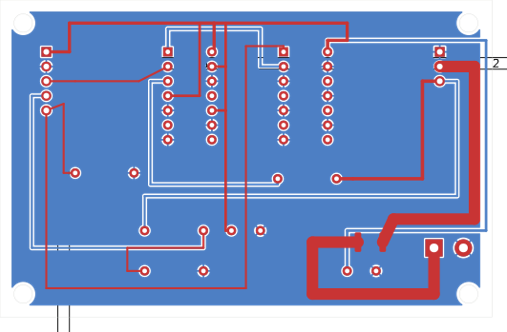

# DYNAMIXEL Neck Interface PCB (1 × XL-320)

Editable board: `TARS-Lite-DXL-Neck.kicad_pcb` (generated by `generate_board.py`). Fabrication outputs: `gerber/`.

## Function

This two-layer board is only the **signal-level bridge and fused power branch for one neck-only XL-320**. It translates ESP32-S3 3.3 V UART to the actuator's 5 V TTL half-duplex DATA line with a 74HCT125 tri-state driver, a 74HCT14 direction inverter, 220 Ω output series resistor, and 10 kΩ / 20 kΩ receive divider. The 74HCT14 makes the library's active-high transmit direction become the 74HCT125's active-low `/OE`; a 10 kΩ pull-down keeps the interface in receive/disabled state during reset. Decoupling capacitors are placed at both logic ICs.

It has a separate 2S actuator input, a PTC fuse (2 A hold) and a fused output to **one** XL-320. Servo power is not sourced from the ESP32 5 V pin. The board is not for the 16-joint leg bus.

## Connector map

| Ref | Pin | Function |
|---|---:|---|
| J1 | 1 | +5 V logic from ESP32 board (not servo power) |
| J1 | 2 | GND |
| J1 | 3 | ESP32 UART TX |
| J1 | 4 | ESP32 UART RX (reduced from DXL DATA) |
| J1 | 5 | DXL direction, high while transmitting |
| J2 | 1 | GND |
| J2 | 2 | Fused 2S servo VDD; actuator must see 6.0–8.4 V |
| J2 | 3 | 5 V TTL DXL DATA |
| J3 | 1 | 2S battery +, through board PTC to J2 pin 2 |
| J3 | 2 | GND |

J2 is a 2.54 mm generic header. Use a correctly keyed, strain-relieved adapter to the XL-320's Molex 53253-0370 interface; verify the manufacturer's GND/VDD/DATA order before connecting. **Never rely on wire colors alone.**

## Power and safety boundaries

- Leg bus remains stock OpenCM + its own manufacturer wiring. The neck DATA line is separate from that leg bus; share only a correctly rated power source/return if the final battery test approves it.
- Fuse the neck branch independently. The XL-320 manual lists 1.1 A stall current at 7.4 V; the included PTC is a starting protection choice, not a substitute for validating the wire, connector, ambient temperature, battery and fuse coordination.
- The board does not contain a regulator for the Pi/ESP32/Arduino or the 5 V hand-servos. Keep positive supply rails separated; make signal grounds common.
- Use a current-limited bench supply for the first actuator test. Do not hot-plug DYNAMIXEL cables.

## Fabrication

Run `/usr/bin/python3 generate_board.py` with KiCad 7's `pcbnew` module, then `./export_gerbers.sh`; the export helper runs `fill_zones.py` in a separate process and saves the filled GND plane before plotting Gerbers. KiCad's connectivity engine reported **0 unconnected items after zone fill**. KiCad 7 in this environment has no CLI DRC command, so a full clearance/width DRC must still be run in the KiCad GUI before fabrication. Also inspect component orientation, thermal clearances, drill map, connector keying and fuse datasheet. This is a prototype: no manufacturer DFM review or powered hardware test has been performed.
